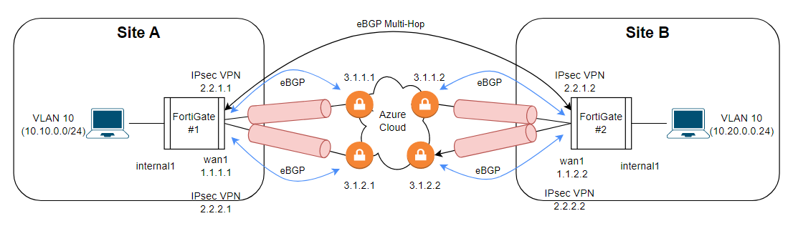

# 포티게이트 장비에서 BGP over Cloud 구현(Azure Cloud)

## 구성도



## 1. WAN 인터페이스 설정

<table>
<tr>
  <td>FortiGate #1</td>
  <td>FortiGate #2</td>
</tr>
<tr>
  <td>

```
config system interface
  edit "wan1"
    set vdom "root"
    set ip 1.1.1.1 255.255.255.0
    set allowaccess ping fgfm
    set type physical
    set role wan
  next
end
```

  </td>
  <td>

```
config system interface
  edit "wan1"
    set vdom "root"
    set ip 1.1.1.2 255.255.255.0
    set allowaccess ping fgfm
    set type physical
    set role wan
  next
end
```

  </td>
</tr>
</table>


## 2. IPsec VPN 터널 설정

<table>
<tr>
  <td>FortiGate #1</td>
  <td>FortiGate #2</td>
</tr>

<tr>
  <td>

```
config vpn ipsec phase1-interface
  edit "azvpn1"
    set interface "wan1"
    set peertype any
    set net-device disable
    set proposal aes256-sha1
    set remote-gw 3.1.1.1
    set psksecret PreSharedKey
  next
end

config vpn ipsec phase2-interface
  edit "azvpn1"
    set phase1name "azvpn1"
    set proposal aes256-sha1
    set auto-negotiate enable
  next
end

config system interface
  edit "azvpn1"
    set vdom "root"
    set ip 2.2.1.1 255.255.255.255
    set allowaccess ping
    set type tunnel
    set tcp-mss 1350
    set remote-ip 2.2.1.3 255.255.255.252
    set interface "wan1"
  next
end
```

  </td>
  <td>

```
config vpn ipsec phase1-interface
  edit "azvpn1"
    set interface "wan1"
    set peertype any
    set net-device disable
    set proposal aes256-sha1
    set remote-gw 3.1.1.2
    set psksecret PreSharedKey
  next
end

config vpn ipsec phase2-interface
  edit "azvpn1"
    set phase1name "azvpn1"
    set proposal aes256-sha1
    set auto-negotiate enable
  next
end

config system interface
  edit "azvpn1"
    set vdom "root"
    set ip 2.2.1.2 255.255.255.255
    set allowaccess ping
    set type tunnel
    set tcp-mss 1350
    set remote-ip 2.2.1.4 255.255.255.252
    set interface "wan1"
  next
end
```

  </td>
</tr>

<tr>
  <td>

```
config vpn ipsec phase1-interface
  edit "azvpn2"
    set interface "wan1"
    set peertype any
    set net-device disable
    set proposal aes256-sha1
    set remote-gw 3.1.2.1
    set psksecret PreSharedKey
  next
end

config vpn ipsec phase2-interface
  edit "azvpn2"
    set phase1name "azvpn2"
    set proposal aes256-sha1
    set auto-negotiate enable
  next
end

config system interface
  edit "azvpn2"
    set vdom "root"
    set ip 2.2.2.1 255.255.255.255
    set allowaccess ping
    set type tunnel
    set remote-ip 2.2.2.3 255.255.255.252
    set interface "wan1"
  next
end
```

  </td>
  <td>

```
config vpn ipsec phase1-interface
  edit "azvpn2"
    set interface "wan1"
    set peertype any
    set net-device disable
    set proposal aes256-sha1
    set remote-gw 3.1.2.2
    set psksecret PreSharedKey
  next
end

config vpn ipsec phase2-interface
  edit "azvpn2"
    set phase1name "azvpn2"
    set proposal aes256-sha1
    set auto-negotiate enable
  next
end

config system interface
  edit "azvpn2"
    set vdom "root"
    set ip 2.2.2.2 255.255.255.255
    set allowaccess ping
    set type tunnel
    set remote-ip 2.2.2.4 255.255.255.252
    set interface "wan1"
  next
end
```

  </td>
</tr>
</table>


## 3. VLAN 인터페이스 설정

<table>
<tr>
  <td>FortiGate #1</td>
  <td>FortiGate #2</td>
</tr>
<tr>
  <td>

```
config system interface
  edit "vlan10"
    set vdom "root"
    set device-identification enable
    set role lan
    set interface "internal1"
    set vlanid 10
  next
end  
```

  </td>
  <td>

```
config system interface
  edit "vlan10"
    set vdom "root"
    set device-identification enable
    set role lan
    set interface "internal1"
    set vlanid 10
  next
end  
```

  </td>
</tr>
</table>


## 4. Firewall Policy 설정

<table>
<tr>
  <td>FortiGate #1</td>
  <td>FortiGate #2</td>
</tr>
<tr>
  <td>

```
config firewall policy
    edit 0
        set name "vlan10-to-azvpn"
        set srcintf "vlan10"
        set dstintf "azvpn1" "azvpn2"
        set srcaddr "all"
        set dstaddr "all"
        set action accept
        set schedule "always"
        set service "ALL"
        set logtraffic all
    next
    edit 0
        set name "azvpn_to_vlan10"
        set srcintf "azvpn1" "azvpn2"
        set dstintf "vlan10"
        set srcaddr "all"
        set dstaddr "all"
        set action accept
        set schedule "always"
        set service "ALL"
        set logtraffic all
    next
end 
```

  </td>
  <td>

```
config firewall policy
    edit 0
        set name "vlan20-to-azvpn"
        set srcintf "vlan20"
        set dstintf "azvpn1" "azvpn2"
        set srcaddr "all"
        set dstaddr "all"
        set action accept
        set schedule "always"
        set service "ALL"
        set logtraffic all
    next
    edit 0
        set name "azvpn_to_vlan20"
        set srcintf "azvpn1" "azvpn2"
        set dstintf "vlan20"
        set srcaddr "all"
        set dstaddr "all"
        set action accept
        set schedule "always"
        set service "ALL"
        set logtraffic all
    next
end 
```

  </td>
</tr>
</table>


## 5. BGP 광고용 ACL 설정

<table>
<tr>
  <td>FortiGate #1</td>
  <td>FortiGate #2</td>
</tr>
<tr>
  <td>

```
config router access-list
    edit "tunnel1"
        config rule
            edit 1
                set prefix 2.2.1.1 255.255.255.255
            next
            edit 2
                set prefix 10.10.0.0 255.255.255.0
            next
        end
    next
    edit "tunnel2"
        config rule
            edit 1
                set prefix 2.2.2.1 255.255.255.255
            next
            edit 2
                set prefix 10.10.0.0 255.255.255.0
            next
        end
    next
end
```

  </td>
  <td>

```
config router access-list
    edit "tunnel1"
        config rule
            edit 1
                set prefix 2.2.1.2 255.255.255.255
            next
            edit 2
                set prefix 10.20.0.0 255.255.255.0
            next
        end
    next
    edit "tunnel2"
        config rule
            edit 1
                set prefix 2.2.2.2 255.255.255.255
            next
            edit 2
                set prefix 10.20.0.0 255.255.255.0
            next
        end
    next
end
```

  </td>
</tr>
</table>


## 6. Azure VPN BGP 설정

<table>
<tr>
  <td>FortiGate #1</td>
  <td>FortiGate #2</td>
</tr>
<tr>
  <td>

```
config router bgp
    set as 65001
    set router-id 10.10.0.1
    set ebgp-multipath enable
    config neighbor
        edit "3.1.1.1"
            set ebgp-enforce-multihop enable
            set soft-reconfiguration enable
            set distribute-list-out "tunnel1"
            set remote-as 65515
        next
        edit "3.1.2.1"
            set ebgp-enforce-multihop enable
            set soft-reconfiguration enable
            set distribute-list-out "tunnel2"
            set remote-as 65515
        next
    end
    config network
        edit 1
            set prefix 2.2.1.1 255.255.255.255
        next
        edit 2
            set prefix 2.2.2.1 255.255.255.255
        next
    end
end
```

  </td>
  <td>

```
config router bgp
    set as 65001
    set router-id 10.20.0.1
    set ebgp-multipath enable
    config neighbor
        edit "3.1.1.2"
            set ebgp-enforce-multihop enable
            set soft-reconfiguration enable
            set distribute-list-out "tunnel1"
            set remote-as 65515
        next
        edit "3.1.2.2"
            set ebgp-enforce-multihop enable
            set soft-reconfiguration enable
            set distribute-list-out "tunnel2"
            set remote-as 65515
        next
    end
    config network
        edit 1
            set prefix 2.2.1.2 255.255.255.255
        next
        edit 2
            set prefix 2.2.2.2 255.255.255.255
        next
    end
end
```

  </td>
</tr>
</table>


## 7. Remote FortiGate VPN BGP 설정

<table>
<tr>
  <td>FortiGate #1</td>
  <td>FortiGate #2</td>
</tr>
<tr>
  <td>

```
config router bgp
    set as 65001
    set router-id 10.10.0.1
    set ebgp-multipath enable
    config neighbor
        edit "2.2.1.2"
            set ebgp-enforce-multihop enable
            set soft-reconfiguration enable
            set distribute-list-out "tunnel1"
            set remote-as 65515
        next
        edit "2.2.2.2"
            set ebgp-enforce-multihop enable
            set soft-reconfiguration enable
            set distribute-list-out "tunnel2"
            set remote-as 65515
        next
    end
    config network
        edit 1
            set prefix 10.10.10.0 255.255.255.0
        next
    end
end
```

  </td>
  <td>

```
config router bgp
    set as 65001
    set router-id 10.20.0.1
    set ebgp-multipath enable
    config neighbor
        edit "2.2.1.1"
            set ebgp-enforce-multihop enable
            set soft-reconfiguration enable
            set distribute-list-out "tunnel1"
            set remote-as 65515
        next
        edit "2.2.2.1"
            set ebgp-enforce-multihop enable
            set soft-reconfiguration enable
            set distribute-list-out "tunnel2"
            set remote-as 65515
        next
    end
    config network
        edit 1
            set prefix 10.10.20.0 255.255.255.0
        next
    end
end
```

  </td>
</tr>
</table>
